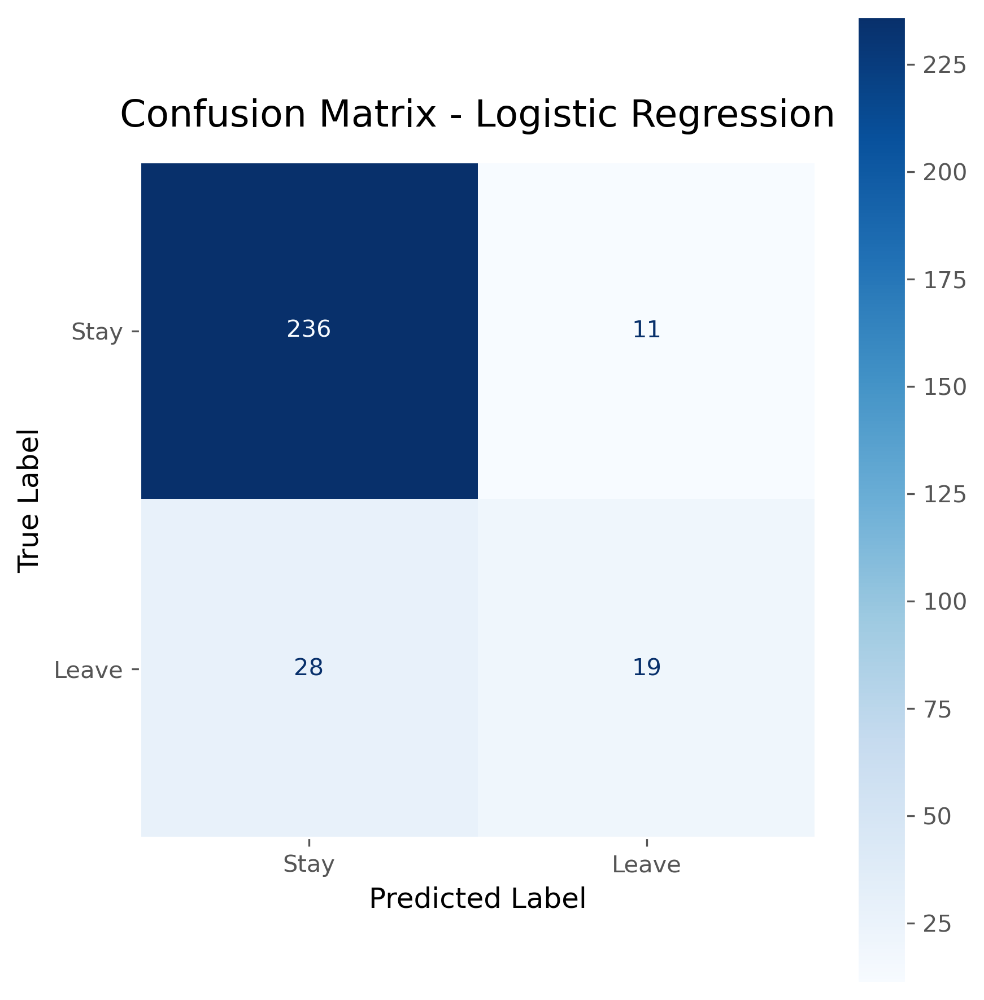
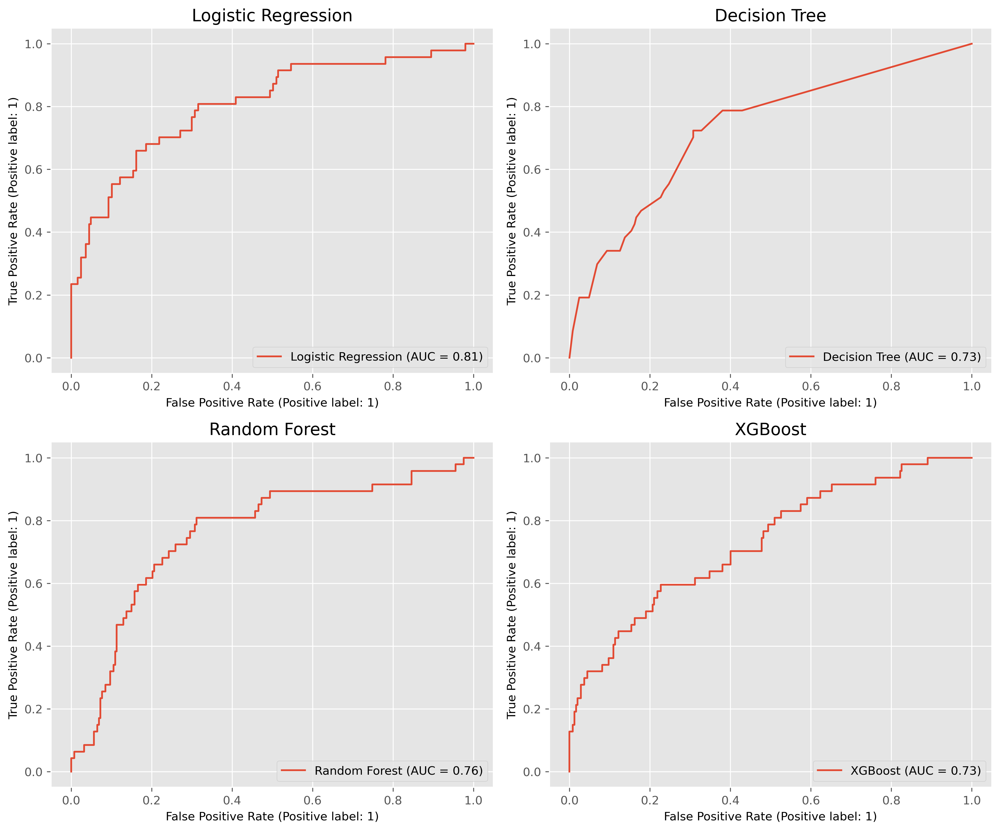
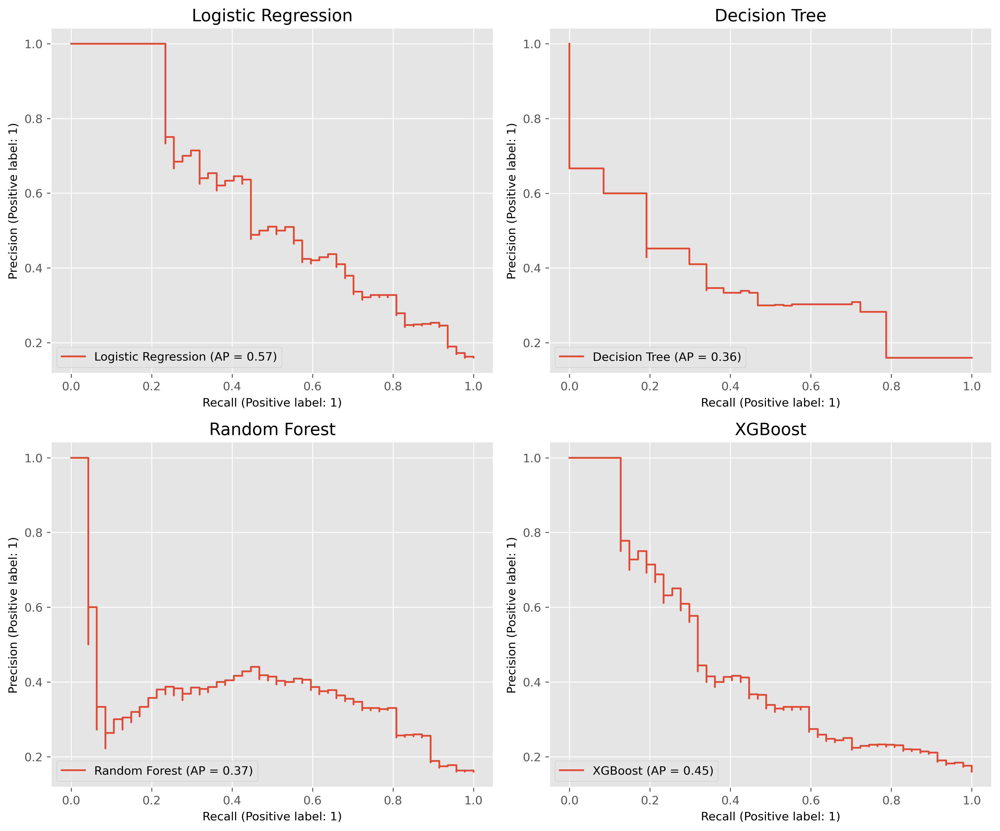
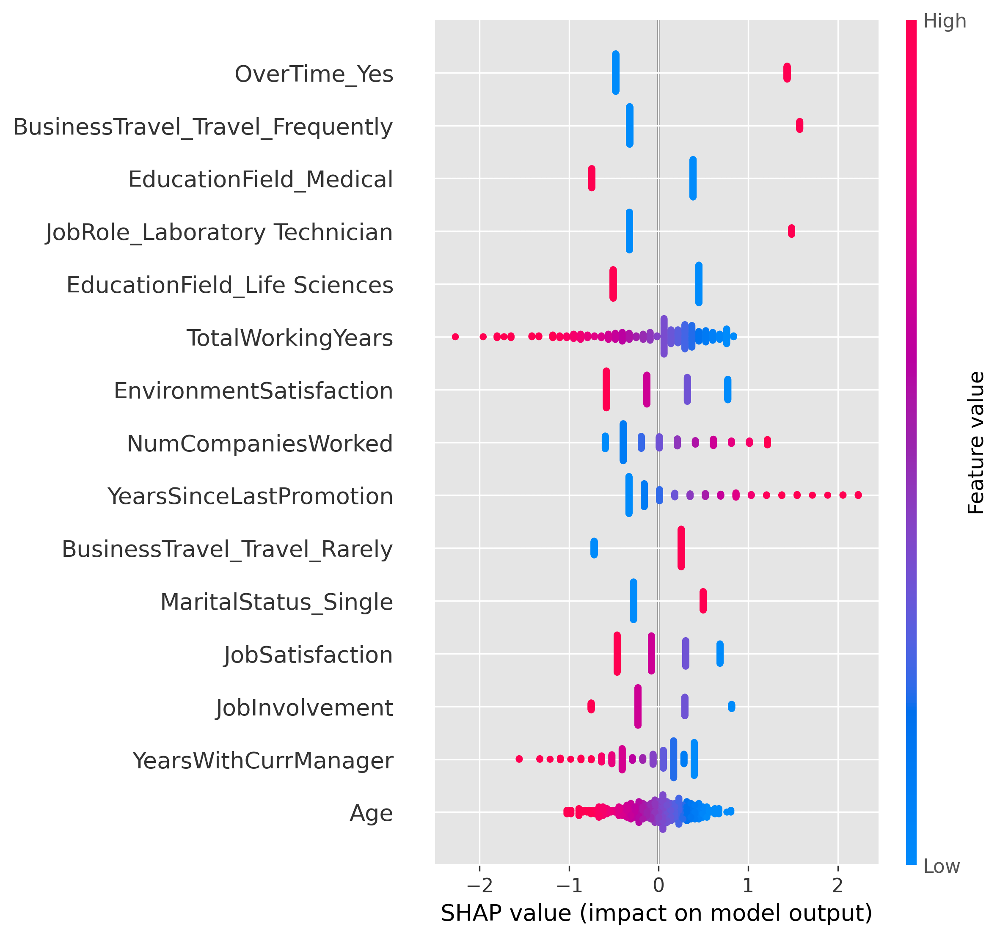
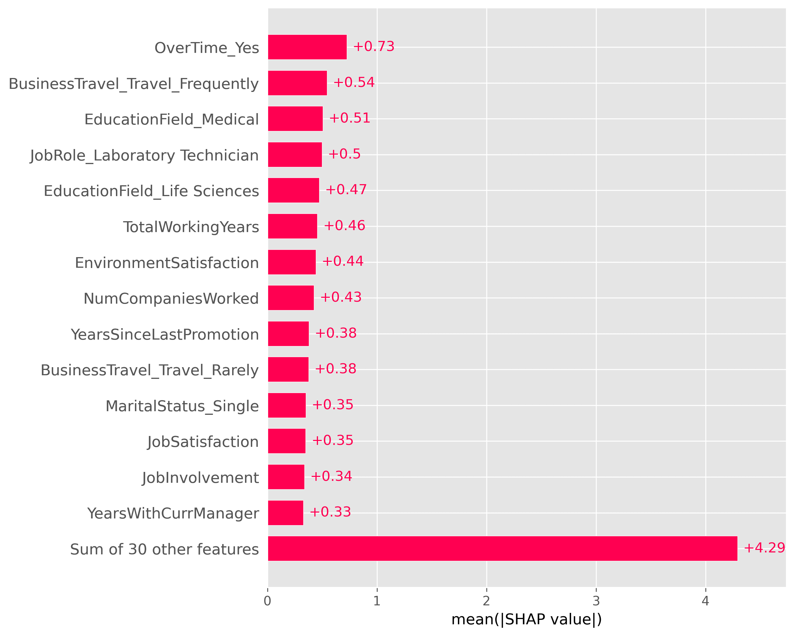
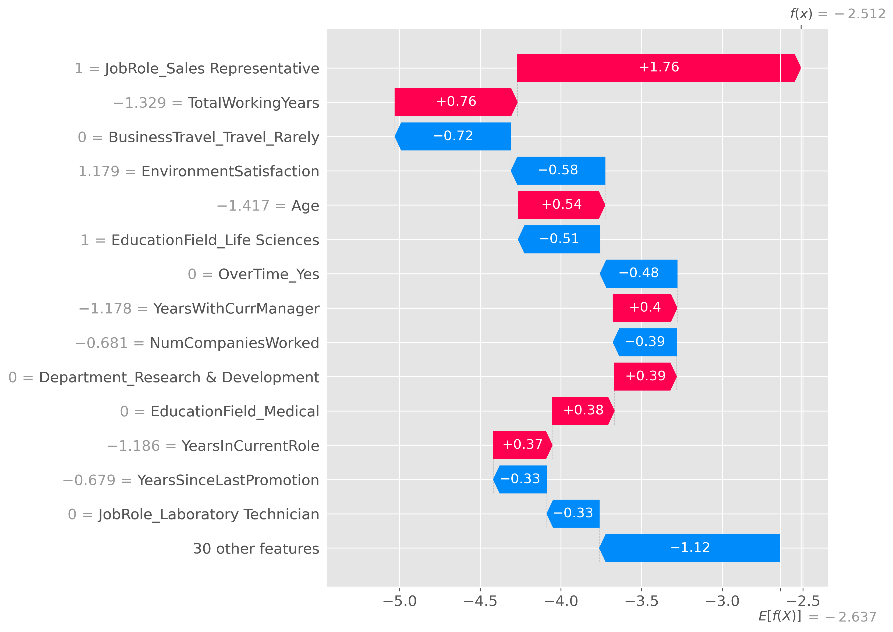
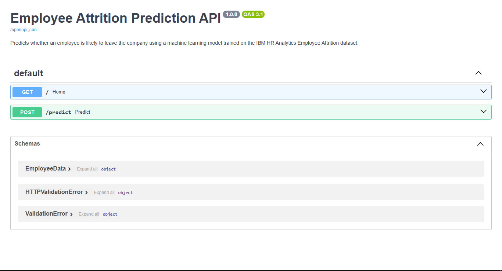
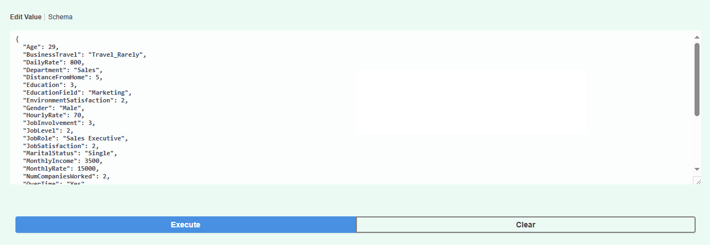
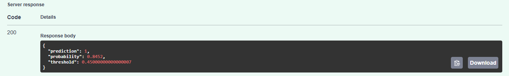

# Employee Attrition Prediction

An end-to-end Machine Learning project that predicts whether an employee is likely to leave a company using the IBM HR Analytics Employee Attrition dataset. This project demonstrates the complete machine learning workflow, including exploratory data analysis, data preprocessing, model selection, hyperparameter tuning, decision threshold optimization, explainable AI with SHAP, saving and loading the trained model with Joblib, and deployment with FastAPI and Docker.

---

## Project Overview

This project follows an end-to-end machine learning workflow commonly used in industry. It aims to predict employee attrition using supervised machine learning models, compare their performance on an imbalanced classification problem, and deploy the best-performing model as a REST API with FastAPI and Docker.

---

## Features

* Exploratory Data Analysis (EDA)
* Data Cleaning
* Data preprocessing with Scikit-learn Pipelines
* Model Training with Logistic Regression, Decision Tree, Random Forest, and XGBoost
* Hyperparameter tuning using RandomizedSearchCV
* Decision Threshold Optimization for Imbalanced Classification
* Comparative Evaluation of Multiple Machine Learning Models
* Model Explainability with SHAP
* Model serialization with Joblib
* REST API Development with FastAPI
* Docker Containerization for Reproducible Deployment

---

## Dataset


**IBM HR Analytics Employee Attrition & Performance**

* **Employees:** 1,470
* **Original Features:** 35
* **Target:** Attrition (Yes / No)
* **Missing Values:** None
* **Duplicates:** None

Target classes are imbalanced:

* Stay (No): Majority class
* Leave (Yes): Minority class

---

## Final Results

After hyperparameter tuning, threshold optimization, and retraining on the combined training and validation data, **Logistic Regression** was selected as the final deployment model based on overall balance between accuracy, precision, recall, ROC-AUC, model simplicity, and production suitability.

| Metric    | Value      |
| --------- | ---------- |
| Accuracy  | **86.73%** |
| Precision | **63.33%** |
| Recall    | **40.43%** |
| F1-score  | **49.35%** |
| ROC-AUC   | **80.60%** |

---

### Model Comparison (Test Set)

| Model | Threshold | Accuracy | Precision | Recall | F1-Score | ROC-AUC |
|------|----------:|---------:|----------:|-------:|---------:|--------:|
| Random Forest | 0.45 | 0.799 | 0.409 | 0.574 | 0.478 | 0.759 |
| Logistic Regression | 0.45 | 0.857 | 0.576 | 0.404 | 0.475 | 0.793 |
| XGBoost | 0.60 | 0.844 | 0.517 | 0.319 | 0.395 | 0.729 |
| Decision Tree | 0.45 | 0.796 | 0.356 | 0.340 | 0.348 | 0.728 |

---

### Classification Report

| Class | Precision | Recall | F1-Score | Support |
|------|----------:|-------:|---------:|--------:|
| Stay | 0.894 | 0.955 | 0.924 | 247 |
| Leave | 0.633 | 0.404 | 0.494 | 47 |
| **Accuracy** | - | - | **0.867** | **294** |
| **Macro Avg** | 0.764 | 0.680 | 0.709 | 294 |
| **Weighted Avg** | 0.852 | 0.867 | 0.855 | 294 |

---

### Confusion Matrix

<p align="center">
  
</p>

---

### ROC Curve

<p align="center">
  
</p>

---

### Precision-Recall Curve

<p align="center">
  
</p>

---

## SHAP Explainability

### SHAP Summary Plot

<p align="center">
  
</p>

#### What it shows

* Most influential features
* Global feature importance
* Feature impact on predictions

---

### SHAP Bar Plot

<p align="center">
  
</p>

---

### SHAP Waterfall / Force Plot

<p align="center">
  
</p>

This plot explains an individual prediction by showing how each feature pushes the prediction toward employee attrition or retention.

---

## FastAPI

Interactive API documentation generated automatically by FastAPI.

### Swagger UI

<p align="center">
  
</p>

---

### Example Request

<p align="center">
  
</p>

---

### Example Response

<p align="center">
  
</p>

---

## Running Locally

Clone the repository:

```bash
git clone https://github.com/sara-kaveh/employee-attrition-prediction.git

cd employee-attrition-prediction
```

Install the required packages:

```bash
pip install -r requirements.txt
```

Run the FastAPI server:

```bash
uvicorn app.main:app --reload
```

Open:

```text
http://127.0.0.1:8000/docs
```

---

## Running with Docker

The Docker image contains the Python environment, dependencies, trained model, and API code, allowing the application to run consistently across different machines.

```bash
docker build -t employee-attrition-api .

docker run -p 8000:8000 employee-attrition-api
```

Open:

```text
http://localhost:8000/docs
```

---

## Project Structure

```text
employee-attrition-prediction/
│
├── app/
│   ├── main.py
│   ├── predictor.py
│   └── schemas.py
│
├── data/
│   └── WA_Fn-UseC_-HR-Employee-Attrition.csv
│
├── figures/
│   ├── confusion_matrix.png
│   ├── roc_curves.png
│   ├── precision_recall_curves.png
│   ├── shap_summary.png
│   ├── shap_bar.png
│   ├── shap_waterfall.png
│   ├── swagger_home.png
│   ├── request.png
│   └── response.png
│
├── models/
│   └── employee_attrition_model.pkl
│
├── notebook/
│   └── employee_attrition_pipeline.ipynb
│
├── Dockerfile
├── .dockerignore
├── requirements.txt
├── requirements-dev.txt
├── README.md
├── LICENSE
└── .gitignore
```

---

## License

This project is licensed under the MIT License.

---

## Author

**Sara kaveh**

GitHub: https://github.com/sara-kaveh
